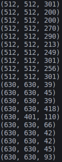

# 新型冠状肺炎自监督分割任务

## 数据集
1. 20cases: https://zenodo.org/record/3757476#collapseOne 包含20个cases，有病灶、左肺、右肺的分割label（全部20个病例都用）
1. 国家生物信息中心: http://ncov-ai.big.ac.cn/download 同样是CT图像，但没有分割label（只用五个病例作为自监督的数据）

## 大概的任务流程
先用Unet去噪做自监督任务，再用Unet学到的特征做病灶分割任务。  
1. 数据处理： nii数据的可视化及格式转换、标准化（CT的窗宽窗位的分布）、分训练验证测试集（要按照病例分，同一个病例的数据不能出现在不同的数据集）
2. 自监督任务： 加噪声有两种（只加在肺部、整张图像都加）
3. 分割任务： 用上王欢的注意力模块、Diceloss

### 窗宽窗位
CT能识别人体内2000个不同灰阶的密度差别。而人的眼睛却只能分辨16 个灰阶度。因此，人眼在CT图像上能分辨的CT值应为125 Hu ( 2000 / 16 ）。换句话说，人体内不同组织CT 值只有相差125Hu 以上，才能为人眼所识别。人体软组织CT值多变化在20 - 50 Hu之间，人眼就无法识别。为此，必须进行分段观察，才能使CT 的优点反映出来。观察的CT 值范围，人们称之为窗宽；观察的中心CT值即为窗位或窗中心。  
肺部的窗宽窗位一般是1500和-600。

### 数据集统计整理
#### 统计
20cases是有病灶分割label的, 每一个病例是三维的, 要找到每个病例所有的带有病灶的slice。  
前10个cases含有三类label值为1,2,3对应左右肺和病灶,需要windowing  
后10个cases只含有病灶Label值为1， 已经过标准化，不需要windowing  
每个case数据的形状：  
  
分好成20个cases,并将前10个病例windowing过了

#### 划分 
先统计带有病灶的slice共1844张, 最多的一个病例216个。将其索引保存为lesionArr.csv文件。  
20个病例分别含有病灶的slice个数: 161, 143, 137, 113, 116, 70, 93, 216, 111, 191, 26, 41, 14, 148, 103, 44, 2, 9, 34, 72  
训练集：[1, 2, 3, 4, 5, 7, 8, 9, 11, 12, 13, 14]  1319  
验证集：[6, 10, 15, 16, 17, 18, 19, 20]   525

#### 图像处理
对于前10个cases图像先在中间剪切成(420,420)再resize成(256,256)  
对于case15，剪切成(470,401)再resize成(256,256)  
对于其他cases，剪切成(470,470)再resize成(256,256)  

